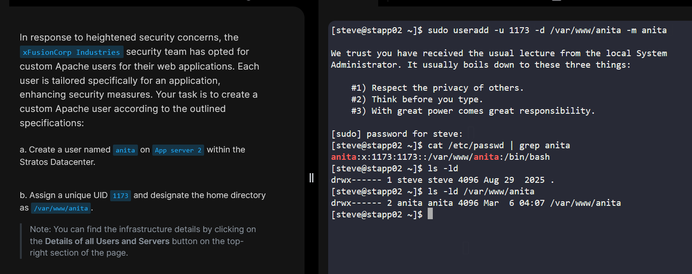

# Creating Custom Apache User (Stratos Lab)

### 1️⃣ Task

```markdown
Creating Custom Apache User on App Server 2 (Stratos Lab)
```

---

### 2️⃣ Description

```markdown
The task is to create a custom Apache user named `anita` on App Server 2 within the Stratos Datacenter, with the following specifications:

- Custom UID: 1173
- Home directory: `/var/www/anita`
- Purpose: Isolate web application data and enhance security
```

---

### 3️⃣ Infrastructure Details

```markdown
| Server         | Hostname  | Description                  |
|----------------|-----------|------------------------------|
| App Server 2   | stapp02   | Target server for user creation |
| Jumphost       | jump_host | Access point to internal servers |
```

---

### 4️⃣Steps to Create a Custom Apache User

1. **Login to App Server 2**

```
ssh steve@stapp02
```

2. **Create the user with a custom UID and home directory**

```bash
sudo useradd -u 1173 -d /var/www/anita -m anita
```

3. **Verify user creation**

```bash
cat /etc/passwd | grep anita
```

Expected output:

```
anita:x:1173:1173::/var/www/anita:/bin/bash
```

4. **Verify home directory permissions**

```bash
ls -ld /var/www/anita
```

Expected output:

```
drwx------ 2 anita anita 4096 Mar 6 10:00 /var/www/anita
```

---

### 5️⃣ Explanation / Notes

```
- `-u 1173` → Assigns a unique UID to the user
- `-d /var/www/anita` → Sets the user's home directory to the Apache application path
- `-m` → Creates the home directory automatically if it does not exist
- Using a dedicated user for each Apache web application enhances security and isolates application data from other system users.
```

---

```markdown
 
```
