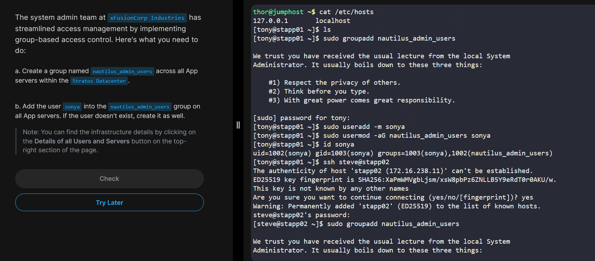
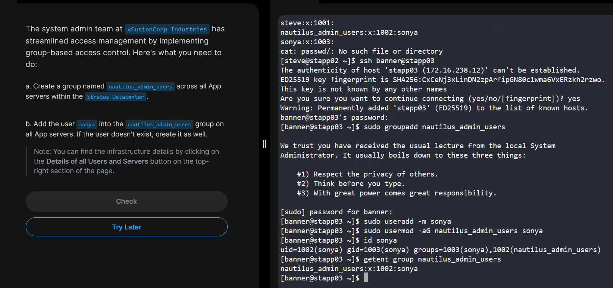
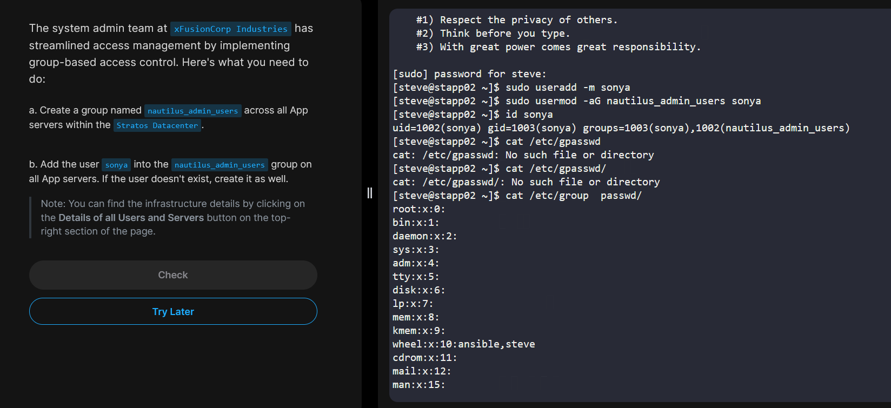

# Task-2 – Group-Based Access Management

## 1️⃣ Task Overview

This task involves creating a **group-based access control** in Stratos Datacenter App Servers. The goal is to:

1. Create a group named `nautilus_admin_users` across all App Servers.
2. Add the user `sonya` into the `nautilus_admin_users` group on all App Servers.
3. If the user `sonya` does not exist, create it.

> **Purpose:** Using group-based access enhances security and makes multi-user access management easier for web applications and system administration.

---

## 2️⃣ Infrastructure Details

| Server         | Hostname  | Description                  |
|----------------|-----------|------------------------------|
| App Server 1   | stapp01   | Target server for group creation |
| App Server 2   | stapp02   | Target server for group creation |
| App Server 3   | stapp03   | Target server for group creation |
| Jumphost       | jump_host | Access point to internal servers |

---

## 3️⃣ Steps to Complete the Task

### **Step 1: Login to each App Server**

```bash
ssh tony@stapp01
ssh steve@stapp02
ssh banner@stapp03
````

---

### **Step 2: Create the Group**

```bash
sudo groupadd nautilus_admin_users
```

* `groupadd` → creates a new group
* If group already exists, it will return an error (ignore if using `-f` flag in a script)

---

### **Step 3: Check / Create User**

```bash
id sonya
```

* If the user does not exist:

```bash
sudo useradd -m sonya
```

* `-m` → automatically creates the user's home directory (`/home/mohammed`)

---

### **Step 4: Add User to Group**

```bash
sudo usermod -aG nautilus_admin_users sonya
```

* `usermod` → modifies an existing user
* `-aG` → append user to supplementary group(s)
* Verify:

```bash
id sonya
```

Expected output:

```
uid=1005(sonya) gid=1005(sonya) groups=1005(sonya),1006(nautilus_admin_users)
```

---

### **Step 5: Verify Group Membership**

```bash
getent group nautilus_admin_users
```

Expected output:

```
nautilus_admin_users:x:1006:sonya
```

---

## 4️⃣ Explanation

* **Group-based access:** simplifies administration by assigning multiple users to a single group with permissions.
* `-f` flag in `groupadd` → prevents error if group already exists.
* `-aG` in `usermod` → ensures user is **added to the group without removing existing groups**.
* Verifying with `id` and `getent group` ensures correctness.
* Automating with a loop saves time and avoids human error.

---





