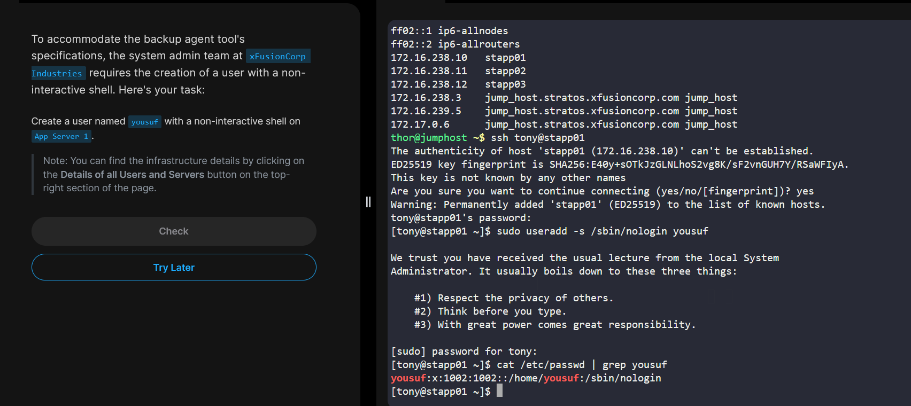

# Create User with Non-Interactive Shell 

## 1️⃣ Overview

The objective of this task is to create a Linux user with a **non-interactive shell** on **App Server 1** in the Stratos Datacenter.

### Requirements

* **Username:** `yousuf`
* **Server:** App Server 1
* **Shell:** Non-interactive shell

A non-interactive shell prevents the user from logging into the system, which is commonly used for **service accounts and security purposes**.

---

# 2️⃣ Infrastructure Details

| Server       | Hostname  | Description                                  |
| ------------ | --------- | -------------------------------------------- |
| App Server 1 | stapp01   | Target server where the user will be created |
| Jumphost     | jump_host | Entry point to access internal servers       |

> In Stratos labs, SSH login user is typically **tony**.

---

# 3️⃣ Steps to Perform the Task

## Step 1: Connect to App Server 1

From the jump host, connect to the target server:

```bash
ssh tony@stapp01
```

This command establishes an SSH connection to **App Server 1** where the user will be created.

---

## Step 2: Create the User with a Non-Interactive Shell

Run the following command:

```bash
sudo useradd -s /sbin/nologin yousuf
```

### Command Explanation

| Option          | Description                       |
| --------------- | --------------------------------- |
| `useradd`       | Command used to create a new user |
| `-s`            | Specifies the user's login shell  |
| `/sbin/nologin` | Prevents interactive login        |
| `yousuf`        | Name of the user                  |

Using `/sbin/nologin` ensures that the user cannot log in to the system.

---

## Step 3: Verify User Creation

Check whether the user was successfully created:

```bash
cat /etc/passwd | grep yousuf
```

### Expected Output

```
yousuf:x:1004:1004::/home/yousuf:/sbin/nologin
```

This confirms that:

* The user exists
* The assigned shell is **/sbin/nologin**

---

## Step 4: Additional Verification

You can also verify using the `id` command:

```bash
id yousuf
```

Example output:

```
uid=1004(yousuf) gid=1004(yousuf) groups=1004(yousuf)
```

---

# 4️⃣ Explanation

* **Non-interactive shells** are commonly used for system or service accounts.
* They prevent users from logging into the system directly.
* This enhances system security by limiting access.

Common non-interactive shells:

* `/sbin/nologin`
* `/usr/sbin/nologin`
* `/bin/false`

These shells are often assigned to accounts used by services like **Apache, MySQL, Jenkins**, etc.

---


